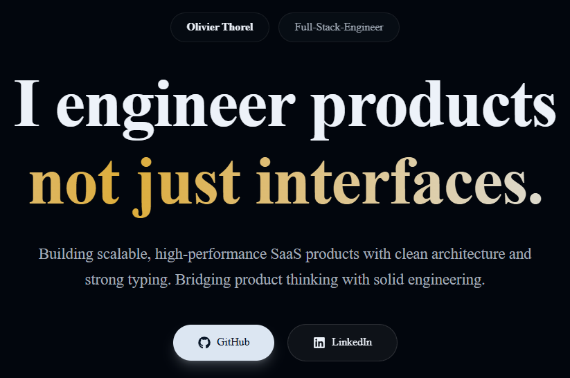

  

  

---

## Portfolio

  

  Production-ready portfolio showcasing projects, architecture, and product thinking.

  

---

## About

Fullstack engineer focused on building **production-ready SaaS products**.

I design and develop complete systems:
- modern frontend
- scalable backend
- structured business logic
- real-world product workflows

Currently working on a **platform connecting candidates and companies**, including onboarding flows, document management, and verification systems.

---

## Tech Stack

### Languages

| Language   | Main Usage                  | Proficiency |
|------------|---------------------------|-------------|
| TypeScript | Fullstack applications     | Expert      |
| JavaScript | Frontend logic             | Advanced    |
| C          | System programming         | Advanced    |
| C++        | Low-level / performance    | Intermediate|
| SQL        | Data modeling & queries    | Advanced    |

---

### Frameworks & Tools

| Category   | Stack |
|------------|------|
| Frontend   | React · Next.js · Tailwind CSS |
| Backend    | Node.js · NestJS · Fastify |
| Database   | PostgreSQL · Prisma |
| DevOps     | Docker · Git · Turborepo |
| Realtime   | WebSockets |
| Low-level  | C · C++ |

---

## Featured Projects

### SaaS Platform

Fullstack application focused on real-world workflows.

- Multi-role onboarding (candidate / recruiter / company)
- Secure document upload (S3 + presigned URLs)
- Verification system with business rules
- Monorepo architecture with shared validation

---

### Realtime Chat Application

Modern messaging platform.

- WebSockets (messages, events, presence)
- Channels and direct messaging
- Reactions and message updates
- Clean UI with Next.js and Tailwind

---

## 42 Core Highlights

- Minishell — Unix shell implementation  
- Philosophers — concurrency and threading  
- Webserv — HTTP server in C++  
- Fullstack web application project  

More available in repositories.

---

## GitHub Insights

  
  

  

---

## Current Focus

- Building scalable SaaS systems  
- Backend architecture and data modeling  
- Clean and efficient frontend UX  
- Developer experience and maintainability  

---

  Building products over showcasing projects

