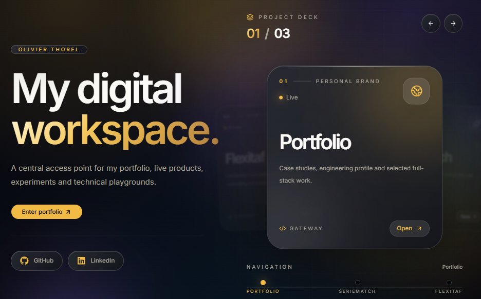

  

  

---

## Project Hub

  
  
  
  

  My main domain is now a visual gateway to my portfolio, live products, experiments and technical playgrounds.

  

---

## About

Fullstack engineer focused on building **production-ready SaaS products** with clean architecture, strong typing and real-world product workflows.

I design and develop complete systems across the stack:

- modern frontend interfaces
- scalable backend APIs
- structured business logic
- typed contracts and shared validation
- real-world onboarding, document and admin workflows

Currently working on **Flexitaf**, a recruitment and mission management SaaS focused on onboarding, document validation and administrative workflow automation.

---

## Tech Stack

### Languages

| Language   | Main Usage               | Proficiency  |
|------------|--------------------------|--------------|
| TypeScript | Fullstack applications    | Expert       |
| JavaScript | Frontend logic            | Advanced     |
| C          | System programming        | Advanced     |
| C++        | Low-level / performance   | Intermediate |
| SQL        | Data modeling and queries | Advanced     |

### Frameworks & Tools

| Category   | Stack |
|------------|-------|
| Frontend   | React · Next.js · Tailwind CSS · shadcn/ui |
| Backend    | Node.js · NestJS · Fastify |
| Database   | PostgreSQL · Prisma |
| Validation | Zod · shared TypeScript contracts |
| DevOps     | Docker · Git · PM2 · Nginx · VPS deployment |
| Search     | Meilisearch |
| Realtime   | WebSockets |
| Low-level  | C · C++ |

---

## Featured Projects

### Flexitaf

Recruitment and mission management SaaS currently in progress.

- Multi-role onboarding flows
- Secure document upload and validation
- Admin review and decision workflows
- Company, recruiter and candidate logic
- Shared business rules between frontend and backend
- Typed fullstack architecture with Next.js, NestJS, Prisma and PostgreSQL

  

---

### SerieMatch

Fullstack series discovery app focused on personalized recommendations.

- Account creation and authentication
- Preference questionnaire based on tastes, platforms and viewing mood
- Searchable catalogue powered by Meilisearch
- Personal library with watch statuses
- Scoring-based recommendation system
- TMDB-powered metadata enrichment

  

---

### Realtime Chat Application

Modern messaging platform focused on real-time interactions.

- WebSockets for messages, events and presence
- Channels and direct messaging
- Reactions and message updates
- Clean UI with Next.js and Tailwind CSS

---

## 42 Core Highlights

- Minishell — Unix shell implementation
- Philosophers — concurrency and threading
- Webserv — HTTP server in C++
- Fullstack web application project

More available in repositories.

---

## GitHub Insights

Most of my work is done on private repositories and production-grade systems.

  

  

---

## Current Focus

- Building scalable SaaS systems
- Backend architecture and data modeling
- Clean and efficient frontend UX
- Typed fullstack workflows
- Developer experience and maintainability
- VPS deployment and production operations

---

  Building products over showcasing projects

